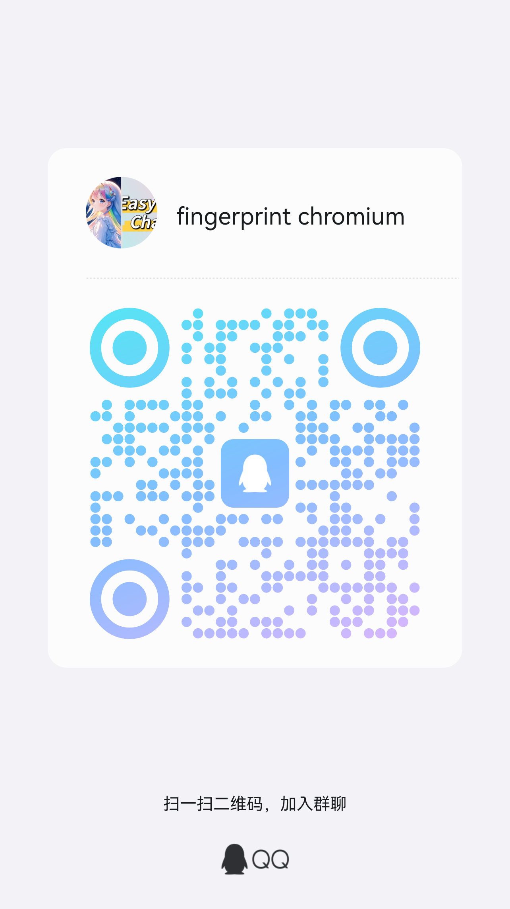

# fingerprint-chromium

[中文文档](README-ZH.md)

*A fingerprint browser based on `Ungoogled Chromium`.*

## Installation and Usage

### Download

Please download the version suitable for your system from the links below. Each major version of Chromium is compiled into a corresponding release. Choose the appropriate version for your operating system:

| **Version**      | **Source Code**                                                                                      | **Windows**                                                                                   | **Linux** | **MacOS**                                                                                   |
|------------------|------------------------------------------------------------------------------------------------------|-----------------------------------------------------------------------------------------------|---------------------------------------------------------------------------------------------|---------------------------------------------------------------------------------------------|
| **Chrome 144**   | Released with Chrome 145  | [Installer](https://github.com/adryfish/fingerprint-chromium/releases/download/144.0.7559.132/ungoogled-chromium_144.0.7559.132-1.1_installer_x64.exe) <br> [ZIP](https://github.com/adryfish/fingerprint-chromium/releases/download/144.0.7559.132/ungoogled-chromium_144.0.7559.132-1.1_windows_x64.zip) | [AppImage](https://github.com/adryfish/fingerprint-chromium/releases/download/144.0.7559.132/ungoogled-chromium-144.0.7559.132-1-x86_64.AppImage) <br> [TAR.XZ](https://github.com/adryfish/fingerprint-chromium/releases/download/144.0.7559.132/ungoogled-chromium-144.0.7559.132-1-x86_64_linux.tar.xz) | |
| **Chrome 142**   | [142.0.7444.175](https://github.com/adryfish/fingerprint-chromium/tree/142.0.7444.175)              | [Installer](https://github.com/adryfish/fingerprint-chromium/releases/download/142.0.7444.175/ungoogled-chromium_142.0.7444.175-1.1_installer_x64.exe) <br> [ZIP](https://github.com/adryfish/fingerprint-chromium/releases/download/142.0.7444.175/ungoogled-chromium_142.0.7444.175-1.1_windows_x64.zip) | [AppImage](https://github.com/adryfish/fingerprint-chromium/releases/download/142.0.7444.175/ungoogled-chromium-142.0.7444.175-1-x86_64.AppImage) <br> [TAR.XZ](https://github.com/adryfish/fingerprint-chromium/releases/download/142.0.7444.175/ungoogled-chromium-142.0.7444.175-1-x86_64_linux.tar.xz) | [142.0.7444.175-1.1_macos.dmg](https://github.com/adryfish/fingerprint-chromium/releases/download/142.0.7444.175/ungoogled-chromium_142.0.7444.175-1.1_macos.dmg) |
| **Chrome 139**   | [139.0.7258.154](https://github.com/adryfish/fingerprint-chromium/tree/139.0.7258.154)              | [Installer](https://github.com/adryfish/fingerprint-chromium/releases/download/139.0.7258.154/ungoogled-chromium_139.0.7258.154-1.1_installer_x64.exe) <br> [ZIP](https://github.com/adryfish/fingerprint-chromium/releases/download/139.0.7258.154/ungoogled-chromium_139.0.7258.154-1.1_windows_x64.zip) | [AppImage](https://github.com/adryfish/fingerprint-chromium/releases/download/139.0.7258.154/ungoogled-chromium-139.0.7258.154-1-x86_64.AppImage) <br> [TAR.XZ](https://github.com/adryfish/fingerprint-chromium/releases/download/139.0.7258.154/ungoogled-chromium-139.0.7258.154-1-x86_64_linux.tar.xz) | [139.0.7258.154-1.1_macos.dmg](https://github.com/adryfish/fingerprint-chromium/releases/download/139.0.7258.154/ungoogled-chromium_139.0.7258.154-1.1_macos.dmg) |
| **Chrome 138**   | [138.0.7204.183](https://github.com/adryfish/fingerprint-chromium/tree/138.0.7204.183)              | [Installer](https://github.com/adryfish/fingerprint-chromium/releases/download/138.0.7204.183/ungoogled-chromium_138.0.7204.183-1.1_installer_x64.exe) <br> [ZIP](https://github.com/adryfish/fingerprint-chromium/releases/download/138.0.7204.183/ungoogled-chromium_138.0.7204.183-1.1_windows_x64.zip) | [138.0.7204.183-1_linux.tar.xz](https://github.com/adryfish/fingerprint-chromium/releases/download/138.0.7204.183/ungoogled-chromium_138.0.7204.183-1_linux.tar.xz) | |
| **Chrome 136**   | [136.0.7103.113](https://github.com/adryfish/fingerprint-chromium/tree/136.0.7103.113)        | [Installer](https://github.com/adryfish/fingerprint-chromium/releases/download/136.0.7103.113/ungoogled-chromium_136.0.7103.113-1.1_installer_x64.exe) <br> [ZIP](https://github.com/adryfish/fingerprint-chromium/releases/download/136.0.7103.113/ungoogled-chromium_136.0.7103.113-1.1_windows_x64.zip) | [136.0.7103.113-1_linux.tar.xz](https://github.com/adryfish/fingerprint-chromium/releases/download/136.0.7103.113/ungoogled-chromium_136.0.7103.113-1_linux.tar.xz) | [136.0.7103.113-1.1_macos.dmg](https://github.com/adryfish/fingerprint-chromium/releases/download/136.0.7103.113/ungoogled-chromium_136.0.7103.113-1.1_macos.dmg) |
| **Chrome 135**   | [135.0.7049.95](https://github.com/adryfish/fingerprint-chromium/tree/135.0.7049.95)        | [Installer](https://github.com/adryfish/fingerprint-chromium/releases/download/135.0.7049.95/ungoogled-chromium_135.0.7049.95-1.1_installer_x64.exe) <br> [ZIP](https://github.com/adryfish/fingerprint-chromium/releases/download/135.0.7049.95/ungoogled-chromium_135.0.7049.95-1.1_windows_x64.zip) | [135.0.7049.95-1_linux.tar.xz](https://github.com/adryfish/fingerprint-chromium/releases/download/135.0.7049.95/ungoogled-chromium_135.0.7049.95-1_linux.tar.xz) | [135.0.7049.95-1.1_macos.dmg](https://github.com/adryfish/fingerprint-chromium/releases/download/135.0.7049.95/ungoogled-chromium_135.0.7049.95-1.1_macos.dmg) |
| **Chrome 134** | [134.0.6998.165](https://github.com/adryfish/fingerprint-chromium/tree/134.0.6998.165) | [Installer](https://github.com/adryfish/fingerprint-chromium/releases/download/134.0.6998.165/ungoogled-chromium_134.0.6998.165-1.1_installer_x64.exe) <br> [ZIP](https://github.com/adryfish/fingerprint-chromium/releases/download/134.0.6998.165/ungoogled-chromium_134.0.6998.165-1.1_windows_x64.zip) | [134.0.6998.165-1_linux.tar.xz](https://github.com/adryfish/fingerprint-chromium/releases/download/134.0.6998.165/ungoogled-chromium_134.0.6998.165-1_linux.tar.xz) | |
| **Chrome 133** | [133.0.6943.126](https://github.com/adryfish/fingerprint-chromium/tree/133.0.6943.126) | [Installer](https://github.com/adryfish/fingerprint-chromium/releases/download/133.0.6943.126/ungoogled-chromium_133.0.6943.126-1.1_installer_x64.exe) <br> [ZIP](https://github.com/adryfish/fingerprint-chromium/releases/download/133.0.6943.126/ungoogled-chromium_133.0.6943.126-1.1_windows_x64.zip) | [133.0.6943.126-1_linux.tar.xz](https://github.com/adryfish/fingerprint-chromium/releases/download/133.0.6943.126/ungoogled-chromium_133.0.6943.126-1_linux.tar.xz) |  |
| **Chrome 132**   | [132.0.6834.159](https://github.com/adryfish/fingerprint-chromium/tree/132.0.6834.159)               | [Installer](https://github.com/adryfish/fingerprint-chromium/releases/download/132.0.6834.159/ungoogled-chromium_132.0.6834.159-1.1_installer_x64.exe) <br> [ZIP](https://github.com/adryfish/fingerprint-chromium/releases/download/132.0.6834.159/ungoogled-chromium_132.0.6834.159-1.1_windows_x64.zip) | [ 132.0.6834.159-1_linux.tar.xz ](https://github.com/adryfish/fingerprint-chromium/releases/download/132.0.6834.159/ungoogled-chromium_132.0.6834.159-1_linux.tar.xz) | [132.0.6834.110-1.1_macos.dmg](https://github.com/adryfish/fingerprint-chromium/releases/download/132.0.6834.159/ungoogled-chromium_132.0.6834.110-1.1_macos.dmg) |

For chinese users, you can download via cloud storage

Quark: https://pan.quark.cn/s/9bb65af874fb

---

You can find the compiled versions for each major Chromium release on the GitHub Release page. Download the appropriate file for your platform.

### Build from Source

**SOURCE CODE IS AVAILABLE IN THE GITHUB REPOSITORY TAGS, NOT IN THE MAIN BRANCH!**

To maintain the integrity of this free and open source project, we've adopted a delayed source code release policy:

- **Current Version**: Compiled binaries are immediately available for all users
- **Source Code**: patch files will be released when the next version is published (typically one month later)

This approach helps prevent unauthorized repackaging and profiteering from our work while maintaining our open source commitment.

Once the source code is released, you can build by referring to the [`ungoogled-chromium`](https://github.com/ungoogled-software/ungoogled-chromium/blob/master/docs/building.md) documentation. Simply replace the `ungoogled-chromium` submodule URL with the `fingerprint-browser` repository URL.

## 📢 Author's Other Projects

<div style="border: 2px solid #f39c12; padding: 15px; background-color: #fffbe6; border-radius: 10px;">

<details open>
<summary><b>🌟 EasyChat - Claude Official Site Mirror</b></summary>

🔥 **EasyChat** is a Claude official site mirror providing China direct access experience with 1:1 restoration of official features for efficient AI assistant services!

- 🌐 **China Access**: Direct connection to Claude official services without VPN.
- 🤝 **Shared Membership**: Cost-effective way to enjoy Claude member features with no account ban risks.
- 👤 **Dedicated Membership**: Exclusive account for your personal use with Claude Code support, full member privileges with stable and uninterrupted service.
- 🔑 **Account Hosting**: Securely host your own account with Claude Code support for seamless China direct access.

🔗 **Visit**: [https://easychat.top](https://easychat.top)

</details>

</div>

<div style="border: 2px solid #3498db; padding: 15px; background-color: #e6f3ff; border-radius: 10px; margin-top: 15px;">

<details open>
<summary><b>🛠️ Flapcode</b></summary>

A one-stop solution designed for users who need Claude Code / Codex but prefer not to self-host.

**Core Advantages:**
- 🌐 **Direct China Access**: Access full Claude Code / Codex functionality at high speed without VPN
- 👤 **Dedicated Accounts**: Individual account per user, no shared account pools, lower cost, stable and reliable
- 💾 **Full Cache Support**: 100% cache availability for improved efficiency and cost savings
- 🌍 **Web Supported**: Claude account also work on the Claude mirror

🔗 **Visit**: [https://flapcode.com](https://flapcode.com)

</details>

</div>

## Features

### Fingerprint Support

You can use creepjs and browserleaks to test fingerprint modification effects.

* **User-Agent**: Modify the browser's `navigator.userAgent`, `navigator.platform`, `navigator.userAgentData` and `Client Hints` information.
* **Operating System**
* **Audio**
* **Plugins**: After removal in version 133+, the browser returns a fixed plugin list.
* **CPU Cores**
* **Memory**
* **WebGL Image**
* **WebGL Metadata**: Modify GPU vendor and graphics card model (currently only supports Linux).
* **Fonts**
* **Canvas Image**
* **Canvas Text**
* **ClientRects**
* **WebRTC**
* **Language Support**
* **Timezone Support**

### Automation Support
**Optimized for automation scenarios, offering the following features:**

1. **Fake Shadow DOM Support**  
   Adds the `fakeShadowRoot` property, equivalent to the `shadowRoot` property, enabling access to Closed Shadow Root for easier automation handling.

2. **Avoid CDP Detection**  
   Prevents Chrome DevTools Protocol (CDP) detection when invoking `Runtime.enable`, enhancing stealthiness for automation tools.

3. **Webdriver**  
   Sets `navigator.webdriver` to false to avoid detection of automation tools.

4. **Headless**  
   Only changes `User-Agent` from `HeadlessChrome` to `Chrome`. Other headless characteristics remain unchanged, use with caution.

### Enabling Fingerprint Features with Command Line Arguments

You can enable or customize fingerprinting and privacy protection features by passing command line arguments when launching the browser:

| **Command Line Argument** | **Description** | **Examples** |
|---------------------------|-----------------|------------------------------|
| **`--fingerprint`** | Specifies the fingerprint seed. When enabled, most fingerprinting features take effect | 32-bit integer |
| **`--fingerprint-platform`** | Specifies the operating system type | `windows`, `linux`, `macos` |
| **`--fingerprint-platform-version`** | Specifies the operating system version | Uses default version if not specified |
| **`--fingerprint-brand`** | Specifies the browser brand in `User-Agent` and `User-Agent Data` | Chrome, Edge, Opera, Vivaldi (default is Chromium if not specified) |
| **`--fingerprint-brand-version`** | Specifies the version number for the browser brand | Uses default version if not specified |
| **`--fingerprint-hardware-concurrency`** | Specifies the number of CPU cores | Integer value (randomly generated from fingerprint seed if not provided) |
| **`--disable-non-proxied-udp`** | Specifies WebRTC policy, by default non-proxied UDP connections are disabled | Recommended to keep default setting |
| **`--lang`** | Sets the browser language | Language code (e.g., `en-US`) |
| **`--accept-lang`** | Sets the languages accepted by the browser | Language codes (e.g., `en-US,en`) |
| **`--timezone`** | timezone | Timezone (e.g., `Asia/Shanghai`, `UTC`) |
| **`--proxy-server`** | proxy server| `http`, `socks` proxy (password authentication not supported) |
| **`--disable-spoofing`** | Disable specific fingerprint spoofing (Chrome 144+) | Comma-separated values: `font`, `audio`, `canvas`, `clientrects`, `gpu` |
| **`--fingerprint-gpu-vendor`** | ~~Customize GPU vendor for WebGL fingerprinting (Removed in Chrome 144)~~ | ~~Vendor string. Removed in Chrome 144~~ |
| **`--fingerprint-gpu-renderer`** | ~~Customize GPU renderer/model for WebGL fingerprinting (Removed in Chrome 144)~~ | ~~Renderer string. Removed in Chrome 144~~ |
| **`--disable-gpu-fingerprint`** | ~~Disable GPU fingerprint (Removed in Chrome 144, use `--disable-spoofing=gpu` instead)~~ | ~~Removed in Chrome 144~~ |

### **New Command Line Arguments in Chrome 139**

**GPU Fingerprinting Parameters**

> **Note**: `--fingerprint-gpu-vendor` and `--fingerprint-gpu-renderer` have been removed in Chrome 144. Use `--disable-spoofing=gpu` to disable GPU fingerprint spoofing instead.

Starting from Chrome 139, GPU fingerprinting is automatically enabled when using the `--fingerprint` parameter. The following optional parameters allow for custom GPU configuration:

- **`--fingerprint-gpu-vendor`** (Optional)
  - Customize the GPU vendor string for WebGL fingerprinting.
  - Examples: `Intel Inc.`, `NVIDIA Corporation`, `AMD`, `Apple`
  - If not specified, GPU vendor will be automatically generated based on the fingerprint seed.

- **`--fingerprint-gpu-renderer`** (Optional)
  - Customize the GPU renderer/model string for WebGL fingerprinting.
  - Examples: `Intel Iris OpenGL Engine`, `NVIDIA GeForce GTX 1060`, `AMD Radeon RX 580`
  - If not specified, GPU renderer will be automatically generated based on the fingerprint seed.

### **User-Agent Customization Command Line Arguments (Chrome 131)**

Chrome 131 introduced two command line arguments for advanced customization of `User-Agent` and `User-Agent Data`:

- **`--fingerprint-brand`**
  - Specifies the browser brand used in `User-Agent` and `User-Agent Data`.
  - Supported values: `Chrome`, `Edge`, `Opera`, `Vivaldi`, or custom brand names.
  - If not specified, the default brand is Chromium.

- **`--fingerprint-brand-version`**
  - Specifies the version number for the specified brand.
  - Default values: `Chrome`, `Edge`, `Opera`, `Vivaldi` all provide default versions, custom versions can also be passed.

These arguments enhance browser environment simulation capabilities, suitable for automation and testing scenarios. If `--fingerprint-brand` is not specified, the default brand will be used.

### **New Features in Chrome 142**

1. **Updated UserAgent and UserAgentData Fingerprint Implementation**
   - Improved fingerprint implementation for `navigator.userAgent` and `navigator.userAgentData`.

2. **Updated Audio Fingerprint Implementation**
   - Enhanced audio fingerprint modification. You can verify the effect at https://pixelscan.net/fingerprint-check

3. **Updated Canvas Fingerprint Implementation**
   - Improved Canvas fingerprint modification for better anti-detection.

4. **GPU Fingerprint Disable Option**
   - GPU fingerprint may have issues in some scenarios. Use `--disable-gpu-fingerprint` parameter to disable GPU fingerprint if needed.
   - ~~Removed in Chrome 144. Use `--disable-spoofing=gpu` instead.~~

### **New Features in Chrome 144**

1. **Removed GPU Fingerprint Parameters**
   - Removed `--fingerprint-gpu-vendor`, `--fingerprint-gpu-renderer`, and `--disable-gpu-fingerprint` parameters.

2. **New `--disable-spoofing` Parameter**
   - A comma-separated parameter to selectively disable specific fingerprint spoofing.
   - Available values: `font`, `audio`, `canvas`, `clientrects`, `gpu`
   - Example: `--disable-spoofing=font,gpu` disables font and GPU fingerprint spoofing.

## Usage Examples

Here are command line examples for several common use cases:

### Basic Usage

```bash
./chrome --fingerprint=1000 --user-data-dir=/tmp/chromium/1000 --timezone="America/Los_Angeles" --proxy-server="your_proxy_server_address"
```

### Customizing User-Agent

```bash
chrome.exe --fingerprint=2023 --fingerprint-platform=macos --fingerprint-platform-version="15.2.0" --fingerprint-brand="Edge"  --user-data-dir=%TEMP%\chromium
```

### Fingerprint Testing

| Testing Platform                                                                                            | Status                                                      |
| -------------------------------------------------------------------------------------------------- | --------------------------------------------------------- |
| [**CreepJS**](https://abrahamjuliot.github.io/creepjs/)                                            | ✔️ 51.5%.                         |
| [**PixelScan**](https://pixelscan.net/fingerprint-check)                                           | ✔️ Pass audio fingerprint detection.                     |
| [**BrowserScan**](https://browserscan.net/)                                                        | ✔️ GPU fingerprint may have issues.                     |
| [**BrowserLeaks**](https://browserleaks.com/)                                                      | ✔️ Supports multiple fingerprint leak detection                                      |
| **Cloudflare**                                                                                     | ✔️                                                        |
| ‣ [Turnstile](https://nopecha.com/demo/turnstile)                                                  | ✔️                                                        |

## User Communication

Scan the QR code to join QQ groups to communicate with other users



If you need Chrome customization development services or are looking for custom development opportunities, please join the development customization group (QQ group 1055930761)

## Sponsors

### IPdodo

A trusted proxy IP provider that delivers all-in-one solutions of high-anonymity, high-speed, and secure proxy IPs combined with S5 forwarding services, tailored for cross-border e-commerce, social media operations, web scraping, data collection, and global business growth.

**Offer**: Register today to get 1GB of free residential proxy traffic.
- Invitation Code: `ATUQ3Q0O`

🔗 [Register Now](https://www.ipdodo.com/account/register?invite_code=ATUQ3Q0O)

### Thordata

A reliable and cost-effective proxy service provider. Providing stable, efficient, and compliant global proxy IP services for enterprises and developers.

**Offer**: Register now and receive a free 1GB residential proxy trial and 2000 SERP API calls.
- Invitation Code: `HQI30H2P`

🔗 [Register Now](https://dashboard.thordata.com/zh/register?invitation_code=HQI30H2P)

### IPFly

A cost-effective IP service provider with high-quality IPs and 7x24 customer support.

**Offer**: Register via exclusive link to enjoy 10% off sitewide.
- Discount Code: `adryfish`
- Invitation Code: `9A2WLGX9`

🔗 [Register Now](https://ipfly.net/activity/OUEyV0xHWDk6TFZKOVhYQzM5NQ==)

## Credits

 * [Ungoogled Chromium](https://github.com/ungoogled-software/ungoogled-chromium)

 ## License

BSD-3-clause. See [LICENSE](LICENSE)